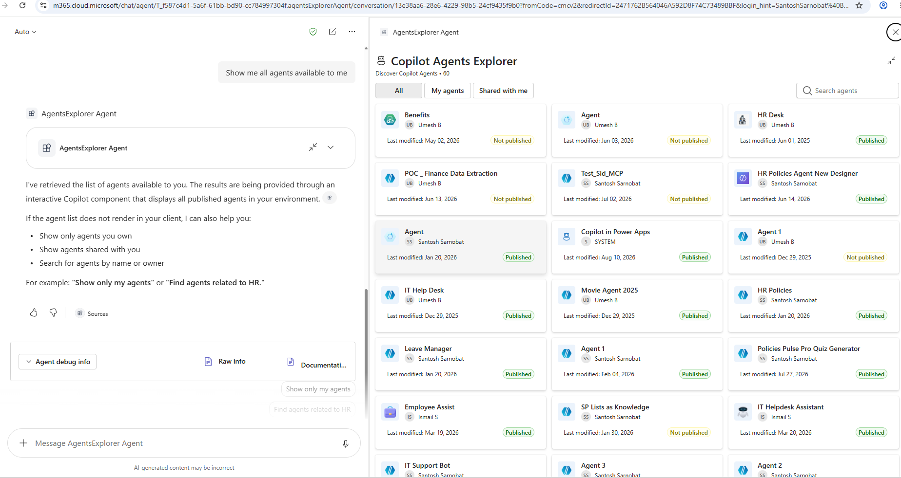
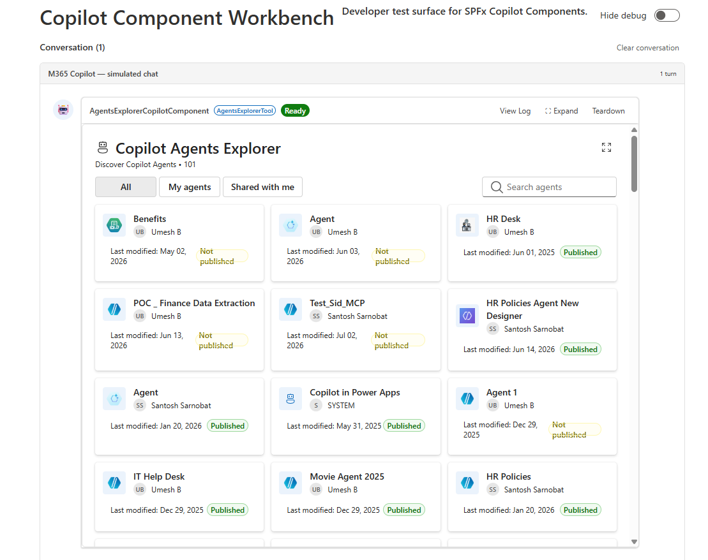
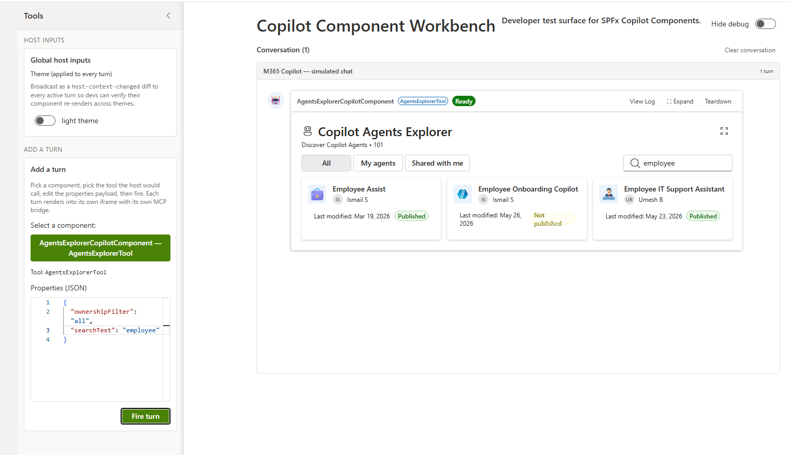

# Agents Explorer - Discover Copilot Agents in Copilot Chat

## Summary

**Agents Explorer** is an SPFx **Copilot Component** that brings a tenant-wide view of Copilot Agents (Power Platform / Copilot Studio bots) directly into the Microsoft 365 Copilot canvas. A declarative agent ("AgentsExplorer Agent") calls it as a tool, and it renders a live, interactive grid of agents inline in the conversation or as a fullscreen overview, reading real Dataverse data across every Power Platform environment the signed-in user can reach.

From the rendered UI, the signed-in user can:

- See every Copilot Agent published across all Dataverse environments they have access to, with icon, owner, last-modified date, and published/not-published status
- Filter results to agents they own ("My agents"), agents shared with them, or all agents
- Search agents by name, owner, or schema name, with the search term extracted automatically from their Copilot request
- Open any agent directly in Copilot Studio from the result card
- Expand the inline card to a fullscreen view for browsing larger agent lists







## Used SharePoint Framework Version


## Applies to

- [SharePoint Framework](https://learn.microsoft.com/sharepoint/dev/spfx/sharepoint-framework-overview) 1.24+ (Copilot Component)
- [Microsoft 365 Copilot extensibility](https://learn.microsoft.com/microsoft-365-copilot/extensibility/)
- [Microsoft 365 tenant](https://learn.microsoft.com/sharepoint/dev/spfx/set-up-your-development-environment)

> Get your own free development tenant by subscribing to the [Microsoft 365 developer program](https://aka.ms/m365/devprogram)

## Prerequisites

This solution discovers Power Platform environments and reads live Dataverse `bot` records through brokered AAD calls (`AadHttpClientFactory`), so beyond the usual SPFx tenant setup it needs the API permissions declared in [`config/package-solution.json`](./config/package-solution.json) approved by a tenant admin:

| Permission                 | Scope             | Why it's needed |
| --------------------------- | ------------------ | ---------------- |
| Microsoft Graph            | `User.Read.All`    | Resolves the signed-in user's display name (`/me`), used to determine which agents count as "my agents" for the ownership filter. |
| PowerApps Service           | `User`             | Calls `api.powerapps.com/.../environments` to discover every Power Platform environment (Dataverse instance) the signed-in user can reach. |
| Dynamics CRM                | `user_impersonation` | Queries the Dataverse `bot` entity (`/api/data/v9.1/bots`) in each discovered environment, on behalf of the signed-in user, to list Copilot Agents. |
| Azure Service Management    | `user_impersonation` | Declared for future Azure Resource Manager scenarios; not currently called by this component's code. |

After deploying the `.sppkg` to the App Catalog, a tenant admin must approve these once in the **SharePoint Admin Center → Advanced → API access**. Any time a requested scope changes, it needs to be re-approved there before it takes effect.

## Solution

| Solution        | Author(s)                                                          |
| ---------------- | ------------------------------------------------------------------- |
| agents-explorer | Siddharth Vaghasia ([siddharth-vaghasia](https://github.com/siddharth-vaghasia)) |

## Version history

| Version | Date             | Comments        |
| ------- | ---------------- | --------------- |
| 1.0.0.0 | Sept 06, 2026    | Initial release |

## Disclaimer

**THIS CODE IS PROVIDED _AS IS_ WITHOUT WARRANTY OF ANY KIND, EITHER EXPRESS OR IMPLIED, INCLUDING ANY IMPLIED WARRANTIES OF FITNESS FOR A PARTICULAR PURPOSE, MERCHANTABILITY, OR NON-INFRINGEMENT.**

---

## Minimal Path to Awesome

- Clone this repository
- Ensure that you are at the solution folder
- In the command-line run:
  - `npm install -g @rushstack/heft`
  - `npm install`
  - `npm run start`
- Since SPFx Copilot Components can't be tested in the local workbench, `npm run start` serves against a hosted tenant workbench (see [`.vscode/launch.json`](./.vscode/launch.json) and [`config/serve.json`](./config/serve.json))
- Package and deploy the solution to your **App Catalog**, grant the API permissions noted under Prerequisites, then invoke the **AgentsExplorer Agent** in Microsoft 365 Copilot

Other build commands can be listed using `heft --help`.

## Features

Agents Explorer demonstrates how to surface a cross-environment Copilot Agents inventory inside the Copilot canvas using an SPFx Copilot Component, reading live Dataverse data rather than mock content.

This sample illustrates the following concepts:

- **Copilot Component UX** — a `CopilotComponent` (`copilotType: "Ux"`) exposed as a tool (`AgentsExplorerTool`) that a declarative agent can call, rendering its own React UI inside the Copilot host.
- **Brokered SSO across two services** — environment discovery (PowerApps Service) and per-environment bot queries (Dataverse Web API) both go through the SPFx-brokered `AadHttpClientFactory`, with no manual token handling, fanning out to every reachable environment in parallel ([`AgentsExplorerService.ts`](./src/services/AgentsExplorerService.ts)).
- **FetchXML over Dataverse Web API** — each environment's `bot` entity is queried with a FetchXML document (aliased attributes plus `systemuser` link-entities for owner/modified-by names) rather than hand-built OData `$select`/`$expand`.
- **Display-mode-aware rendering** — a single React component (`AgentsExplorer.tsx`) renders a compact inline grid or a fullscreen overview based on the host-advertised display mode (`inline` / `fullscreen`), and can request a mode switch through the Copilot bridge.
- **Tool argument extraction** — the tool's `ownershipFilter` and `searchText` arguments (defined via Zod in [`AgentsExplorerCopilotComponentProperties.ts`](./src/copilotComponents/agentsExplorer/AgentsExplorerCopilotComponentProperties.ts)) let Copilot pre-apply a filter (e.g. "my agents") or a search term extracted from the user's natural-language request.
- **Bridge-mediated navigation** — opening an agent in Copilot Studio goes through `bridge.openLinkAsync` rather than `window.open`, since Copilot Components render inside a sandboxed iframe with no direct access to the host window.
- **Theme awareness** — light/dark theme driven by the Copilot host context, using Fluent UI v9 theme tokens throughout.

> Notice that better pictures and documentation will increase the sample usage and the value you are providing for others. Thanks for your submissions advance.

> Share your web part with others through Microsoft 365 Patterns and Practices program to get visibility and exposure. More details on the community, open-source projects and other activities from http://aka.ms/m365pnp.

## Some Advance Concepts Explored

### Adding a new tool parameter that Copilot can populate

The tool's input parameters are defined once, as a [Zod](https://zod.dev/) schema, in [`AgentsExplorerCopilotComponentProperties.ts`](./src/copilotComponents/agentsExplorer/AgentsExplorerCopilotComponentProperties.ts) and converted to JSON Schema via `zod-to-json-schema`:

```ts
const propertiesSchema = z.object({
  ownershipFilter: z
    .enum(['all', 'my', 'shared'])
    .optional()
    .describe('Which agents to show: all agents, only mine, or only agents shared with me.'),
  searchText: z.string().optional().describe('Optional text to filter agents by name or owner.')
});
```

The compiled JSON Schema is referenced by the component's manifest, which is how the Copilot host discovers the tool's parameters and their descriptions. To add a new parameter:

1. Add a field to the `z.object({...})` above, with a `.describe(...)` that tells Copilot what to extract and when (mark it required/optional, describe the expected format, and give worked examples of phrases → values).
2. Read the new field off `this.properties` in [`AgentsExplorerCopilotComponent.tsx`](./src/copilotComponents/agentsExplorer/AgentsExplorerCopilotComponent.tsx), pass it through the props in `render()`, and use it in [`AgentsExplorer.tsx`](./src/copilotComponents/agentsExplorer/components/AgentsExplorer.tsx) to drive the component's behavior (it's used there today to seed the initial search box value and ownership toggle).

## References

- [Getting started with SharePoint Framework](https://learn.microsoft.com/sharepoint/dev/spfx/set-up-your-development-environment)
- [Microsoft 365 Copilot extensibility](https://learn.microsoft.com/microsoft-365-copilot/extensibility/)
- [Use Microsoft Graph in your solution](https://learn.microsoft.com/sharepoint/dev/spfx/web-parts/get-started/using-microsoft-graph-apis)
- [Publish SharePoint Framework applications to the Marketplace](https://learn.microsoft.com/sharepoint/dev/spfx/publish-to-marketplace-overview)
- [Microsoft 365 Patterns and Practices](https://aka.ms/m365pnp) - Guidance, tooling, samples and open-source controls for your Microsoft 365 development
- [Heft Documentation](https://heft.rushstack.io/)

