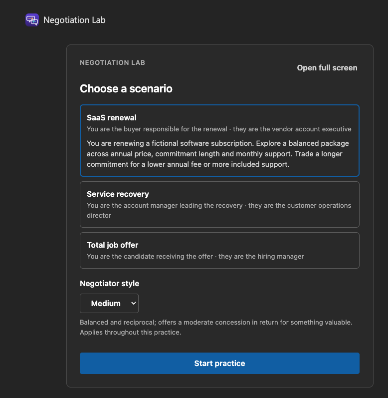
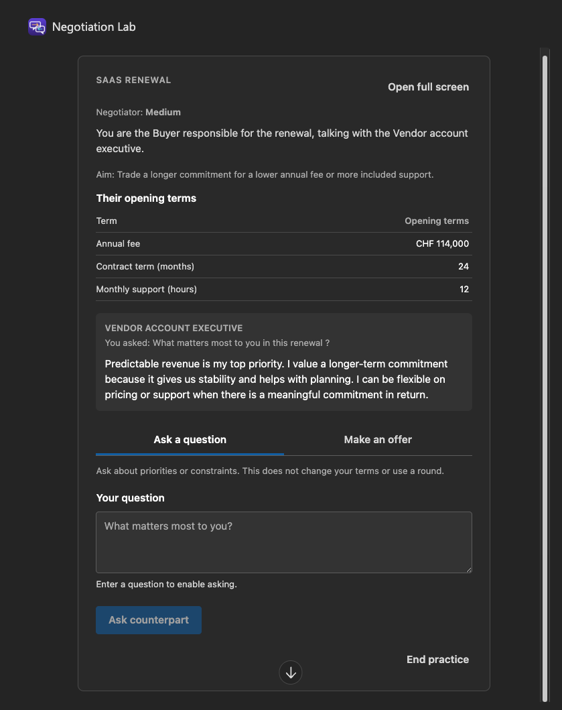
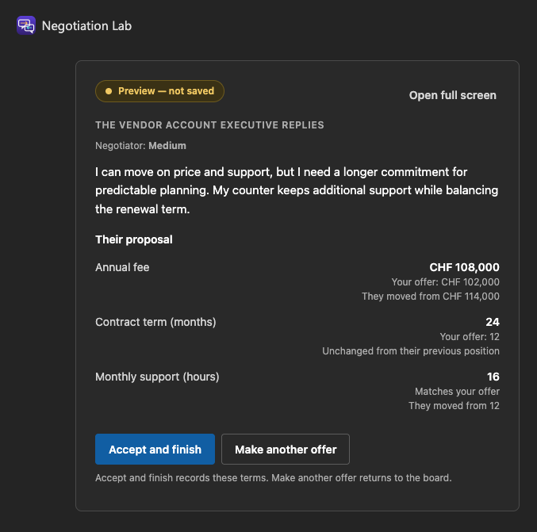
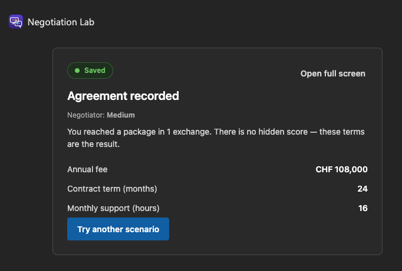

# Negotiation Lab

<a href="./assets/choose-scenario.png"></a>

## Summary

This sample demonstrates how to augment an SPFx React component with Microsoft 365 Copilot. Users ask questions, exchange offers and confirm agreements in three fictional scenarios: **SaaS renewal**, **Total job offer** and **Service recovery**.

## Features

- Provision SharePoint lists, fields and views from the component using APVEE's `@apvee/m365-actionable-provisioning` package.
- Send messages and structured context from React to Copilot, then display its answers and proposed terms inside the component.
- Validate proposals and let the user confirm before saving the result to SharePoint using PnPjs.
- Resume saved practices and choose a **Cool**, **Medium** or **Hard** counterpart.
- Support light/dark themes and inline/fullscreen views with React 18.

The sample uses the SPFx Copilot bridge and two component tools. No custom backend or direct LLM API calls are required.

## Compatibility


SharePoint Copilot Apps and the APIs used here are preview capabilities.

## Applies to

- [SharePoint Framework](https://learn.microsoft.com/sharepoint/dev/spfx/sharepoint-framework-overview)
- [Microsoft 365 Copilot extensibility](https://learn.microsoft.com/microsoft-365-copilot/extensibility/)

## Prerequisites

- Node.js `>=22.14.0 <23.0.0`.
- A SharePoint App Catalog and access to SharePoint Copilot Apps and Microsoft 365 Copilot.
- An existing same-tenant SharePoint site with **Manage Lists** permission for setup.
- Players need View Items on `NegotiationScenarios` and View, Add and Edit Items on `NegotiationSessions`.

## Minimal path to awesome

1. Clone this repository or [download this sample](https://pnp.github.io/download-partial/?url=https://github.com/pnp/spfx-copilot-components/tree/main/samples/negotiation-lab).
2. Set `targetSiteUrl` in [config/negotiation-lab.deployment.json](./config/negotiation-lab.deployment.json) to your existing SharePoint site. The default `/sites/negotiation-lab` is an example.
3. From `samples/negotiation-lab`, build the package:

   ```bash
   npm ci
   npm run build
   ```

4. Upload `sharepoint/solution/negotiation-lab.sppkg` to the tenant App Catalog and deploy it.
5. Use **Sync to Teams**, then install or update the **Negotiation Lab** agent.
6. Open the agent in a new Microsoft 365 Copilot chat and say **Open Negotiation Lab**. Choose **Create the two lists** if prompted.

Setup provisions `NegotiationScenarios` for the three scenarios and `NegotiationSessions` for saved practices. Rebuild if you change the configured site.

`npm run build` clears previous generated packages, runs the tests and creates the production package.

For local rendering checks, run `npx heft trust-dev-cert` and `npm run start`. Test the full Copilot interaction after deployment.

## Try it

1. Start **SaaS renewal** with a **Medium** counterpart.
2. Under **Ask a question**, ask: “What matters most to you in this renewal?”
3. Under **Make an offer**, propose **CHF 108,000 / 36 months / 12 support hours** and explain the trade.
4. Review the response. Choose **Accept and finish** to record the agreement or **Make another offer** to continue.

Questions also work in Microsoft 365 Copilot chat. Say **show my practice** to reopen the board.

## Negotiation Lab in action

### Ask a question

Copilot's answer appears inside the practice board.

<a href="./assets/ask-counterpart.png"></a>

### Review a proposal

Review the terms before deciding whether to accept or continue negotiating.

<a href="./assets/preview.png"></a>

### Record the agreement

The confirmed agreement shows the same terms as the preview.

<a href="./assets/agreement.png"></a>

## Limitations

- Fictional practice only. Do not enter confidential or personal information.
- Copilot responses and tool routing can vary. Validation checks terms, not every claim in the generated wording.
- New conversation turns replace earlier boards. Use one active practice conversation per user.

## Further reading

- [Architecture and state handling](./docs/architecture.md)

## Version history

| Version | Date | Change |
| --- | --- | --- |
| 1.0.0 | 2026-09-06 | Initial public release. |

## Contributors

- [Nello D'Andrea](https://github.com/ferrarirosso)

## Help

For questions or problems, search the [repository issues](https://github.com/pnp/spfx-copilot-components/issues) or open a new issue with reproduction steps.

## Disclaimer

**THIS CODE IS PROVIDED _AS IS_ WITHOUT WARRANTY OF ANY KIND, EITHER EXPRESS OR IMPLIED, INCLUDING ANY IMPLIED WARRANTIES OF FITNESS FOR A PARTICULAR PURPOSE, MERCHANTABILITY, OR NON-INFRINGEMENT.**

## References

- [Overview of SharePoint Copilot Apps](https://learn.microsoft.com/sharepoint/dev/spfx/copilot/overview-copilot-apps)
- [Build your first SharePoint Copilot App](https://learn.microsoft.com/sharepoint/dev/spfx/copilot/get-started/build-your-first-copilot-app)
- [Microsoft 365 Patterns and Practices](https://aka.ms/m365pnp)


